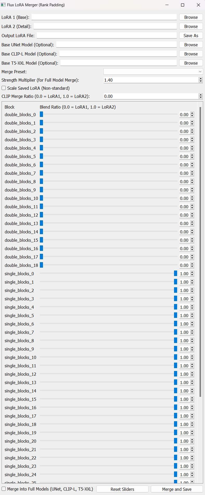

# Flux LoRA Merger GUI (Rank Padding)

A simple graphical user interface (GUI) built with PyQt5 to merge LoRA (Low-Rank Adaptation) `.safetensors` files, specifically designed for models following the Blackforest Labs Flux architecture (featuring double and single blocks). This tool handles merging LoRAs with potentially different ranks by padding the smaller rank LoRA to match the larger one before performing a weighted average based on user-defined ratios.

Repository: [https://github.com/tarkansarim/Flux-Lora-Block-Merger.git](https://github.com/tarkansarim/Flux-Lora-Block-Merger.git)

## Features

*   **Graphical Interface:** Easy-to-use interface for selecting LoRAs and setting merge parameters.
*   **Rank Mismatch Handling:** Uses zero-padding to merge LoRAs of different ranks, preserving the structure of the higher-rank LoRA.
*   **Block-Level Control:** Individual sliders for all identified `double_blocks` (19) and `single_blocks` (38) in the Flux architecture, allowing fine-grained merging ratios.
*   **CLIP Ratio Control:** Separate ratio control for non-block weights (assumed to be Text Encoder/CLIP). Default ratio is 0.0 (favoring LoRA 1).
*   **Presets:** Quickly set all block sliders to favor LoRA 1 or LoRA 2, or target specific block types.
*   **Merge to Full Model (Optional):** Ability to merge the resulting LoRA directly into base UNet (Flux), CLIP-L, and T5-XXL models. Merged full models are saved to the *original base model directories*.
*   **Settings Persistence:** Remembers your last used file paths and slider settings between sessions.
*   **Installer Scripts:** Includes convenience scripts for Windows (`run_lora_merger_windows.bat`) and Linux (`run_lora_merger_linux.sh`) with robust error checking to set up a virtual environment and install dependencies using `requirements.txt`.

## Screenshot

***IMPORTANT: Replace the line below with your actual screenshot!***
  <!-- Add screenshot file (e.g., screenshot.png) to repo and update this line -->

## Requirements

*   Python 3.8+ (Ensure Python is installed and added to your system PATH)
*   **PyTorch:** Must be installed (CPU or correct CUDA version). See installation steps.
*   Dependencies listed in `requirements.txt`:
    *   PyQt5
    *   safetensors
    *   tqdm

## Installation & Usage (Windows - Recommended)

1.  Download the repository files (e.g., using "Download ZIP" on GitHub or `git clone https://github.com/tarkansarim/Flux-Lora-Block-Merger.git`).
2.  Place the files in a desired location. Ensure `flux_lora_merger_gui.py`, `run_lora_merger_windows.bat`, and `requirements.txt` are in the same folder.
3.  Double-click the `run_lora_merger_windows.bat` file.
4.  It will robustly:
    *   Check if Python is accessible.
    *   Create/activate a Python virtual environment named `venv` in the **same directory**.
    *   Update pip within the venv.
    *   Install a **CPU version** of PyTorch if not already present in the venv.
    *   Check for `requirements.txt` and install other dependencies (`PyQt5`, `safetensors`, `tqdm`) from it.
    *   Check for `flux_lora_merger_gui.py` and launch the GUI.
    *   Pause with error messages if any step fails.
5.  Follow the GUI Usage steps below.
    *(Note: If you need a GPU/CUDA version of PyTorch, manually install it within the activated `venv` *before* running the batch file. The script will detect it and skip the CPU installation. See [PyTorch installation guide](https://pytorch.org/get-started/locally/)).*

## Installation & Usage (Linux)

1.  **Clone or Download:** Get the repository files. Ensure `flux_lora_merger_gui.py`, `run_lora_merger_linux.sh`, and `requirements.txt` are in the same folder.
    ```bash
    git clone https://github.com/tarkansarim/Flux-Lora-Block-Merger.git
    cd Flux-Lora-Block-Merger # Navigate to the repo folder
    ```
2.  **Create Venv & Install PyTorch Manually:** This is crucial as the script doesn't handle PyTorch versions automatically.
    *   Create the environment (in the current directory): `python3 -m venv venv`
    *   Activate it: `source venv/bin/activate`
    *   Install PyTorch (CPU or correct CUDA version): Follow official instructions at [https://pytorch.org/get-started/locally/](https://pytorch.org/get-started/locally/). *Ensure the `venv` is active during installation!*
    *   (Optional: `deactivate` now if you wish)
3.  **Make the script executable (first time only):**
    ```bash
    chmod +x run_lora_merger_linux.sh
    ```
4.  **Run the setup & launch script:**
    ```bash
    ./run_lora_merger_linux.sh
    ```
5.  This will:
    *   Activate the `venv` in the current directory.
    *   Update pip.
    *   Install the *other* dependencies (`PyQt5`, `safetensors`, `tqdm`) from `requirements.txt`.
    *   Launch the GUI (`flux_lora_merger_gui.py`), with error checking.
6.  Follow the GUI Usage steps below.

## Installation & Usage (Manual - macOS/Other)

1.  **Clone or Download:** Get the repository files.
2.  **Create & Activate Virtual Environment (Recommended):**
    ```bash
    python3 -m venv venv # Creates venv in current dir
    # Activate: source venv/bin/activate
    ```
3.  **Install Dependencies:**
    *   **Install PyTorch first:** Follow official instructions at [https://pytorch.org/get-started/locally/](https://pytorch.org/get-started/locally/).
    *   **Install other requirements:**
        ```bash
        pip install -r requirements.txt
        ```
4.  **Run the script:**
    ```bash
    python3 flux_lora_merger_gui.py
    ```
5.  Follow the GUI Usage steps below.

## Usage (GUI)

1.  Use the "Browse" buttons to select LoRA 1 (Base) and LoRA 2 (Detail).
2.  Use "Save As" for the output merged LoRA file.
3.  Adjust block sliders (0.0 = 100% LoRA 1, 1.0 = 100% LoRA 2).
4.  Adjust "CLIP Merge Ratio" for text encoder parts (Default: 0.0).
5.  Use "Merge Preset" for quick settings.
6.  **Optional Full Model Merge:**
    *   Check the "Merge into Full Models..." box.
    *   Select base UNet, CLIP-L, T5-XXL files.
    *   Adjust "Strength Multiplier" (Default: 1.4).
7.  Click "Merge and Save".
8.  The merged LoRA is saved to the specified output path. Merged full models are saved in their **original base model directories**.

## License

This project is licensed under the MIT License - see the [LICENSE](LICENSE) file for details.

## Contributing

Feel free to open issues on GitHub for bug reports or feature requests. Pull requests are also welcome.